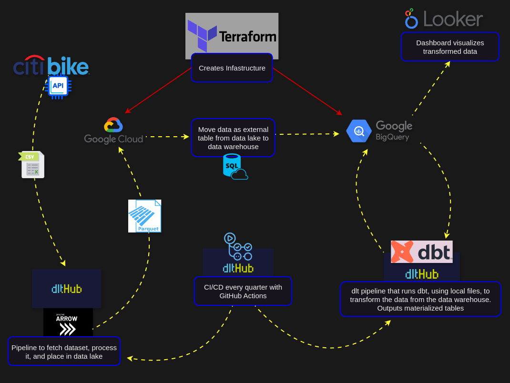
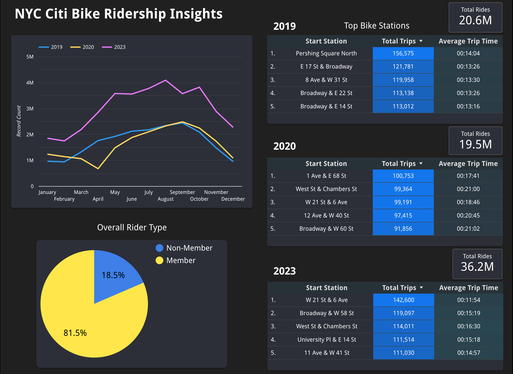

# Biking in the Big Apple: Trends and Insights in New York City's Citi Bike Program

## Project Overview 🚀

This project analyzes data from New York City's Citi Bike share program for the years 2019, 2020, and 2023. The primary goal is to investigate ridership trends before the 2020 pandemic, during 2020, and in the year 2023. The project aims to answer the following questions:

1. How did the 2020 pandemic impact ridership, and did it rebound significantly by 2023?
2. Are there any differences or similarities in monthly usage trends for each year, particularly during the 2020 pandemic?
3. What is the comparison between members of the bike program and non-members in terms of total usage across all three years combined?
4. Which bike stations are the most popular, and what are the total trips and average trip times for each of the top 5 stations?

By analyzing the data, we can gain insights into the popularity of certain areas in New York City among Citi Bike users and determine if the most popular stations change over time, even as Citi Bike relocates bike stations. The project also examines whether the average trip time for users changes significantly when starting and completing trips at these popular stations.

Through this analysis, we aim to better understand the impact of the pandemic on bike-sharing in New York City and identify any lasting changes in ridership patterns and user behavior.


## Tech Stack 🖥 

- **Terraform**: Used for Infrastructure as Code (IaC) to create a Google Cloud Storage (GCS) bucket and BigQuery dataset

- **Google Cloud Storage (GCS)**: Used as a data lake to store the raw Citi Bike data in parquet format

- **Google BigQuery**: Used as the data warehouse for storing and analyzing the Citi Bike data

- **PyArrow**: Used in conjunction with the Data Load Tool (dlt) for the initial data pipeline

- **Data Load Tool (dlt)**: Utilized for the ETL process, creating data pipelines, dbt transformations, and setting up GitHub Actions

- **dbt (Data Build Tool)**: Employed for performing data transformations and running tests on the data stored in BigQuery

- **GitHub Actions**: Integrated with dlt to deploy a monthly triggered data pipeline

- **Google Looker Studio**: Used for creating a dashboard to visualize the analyzed Citi Bike data

<p align="center">
    
</p>

## Data Structure 🧱

### Raw Tables
| 2019 | 2020 | 2023 |
| :-- | :--- | :--- |
| tripduration | tripduration | - |
| startime | startime | started_at|
| stoptime | stoptime | ended_at |
| start station id | start station id | start_station_id |
| start station name | start station name | start_station_name |
| start station latitude | start station latitude | start_lat |
| start station longitude | start station longitude | start_lng |
| end station id | end station id | end_station_id |
| end station name | end station name | end_station_name|
| end station latitude | end station latitude | end_lat |
| end station longitude | end station longitude | end_lng |
| bikeid | bikeid | ride_id |
| usertype | usertype | member_casual |
| birth year | birth year | - |
| gender | gender | - |
| - | - | rideable_type |

#### Number of rows
* **2019 -** 20,551,697
* **2020 -** 19,506,857
* **2023 -** 36,226,600

### Final Materialized Table

| 2019 - 2023 (Combined)|
| :-- |
| ride_id |
| start_time_date |
| stop_time_date |
| trip_duration_seconds |
| start_station_name |
| stop_station_name |
| user_category |

#### Number of rows
* 76,285,697

## Analysis 📊
<p align="center">
    
</p>

Link to dashboard is [here](https://lookerstudio.google.com/s/qN70pJ0jWfY). (If the dashboard doesn't display, it's due to the GCS credits ending)

## Instructions to Replicate the Project 🧭

### Step 1: Set up Google Cloud
1. Create a [Google Cloud account](https://cloud.google.com) if you don't have one already. Google Cloud offers a $300 credit that's valid for 90 days, which can be used for this project.
   
2. Create a *new project* and *project ID* within Google Cloud. You can do this either through the [Google Cloud Console](https://cloud.google.com/resource-manager/docs/creating-managing-projects) or using the [Google Cloud SDK CLI](https://cloud.google.com/sdk/docs/install).  
  If you prefer the CLI approach, follow [the steps in this video](https://www.youtube.com/watch?v=YGH0LD6YUY0).

3. Create a *Service Account* through the **IAM (Identity and Access Management)** section in Google Cloud Console. Assign the following permission roles to the service account:
   - Viewer
   - Storage Admin
   - Storage Object Admin
   - BigQuery Admin
   - Owner (if needed)
4. Generate and download a *JSON key* for the newly created *Service Account*. It will be used when interacting with Terraform, dbt and dlt scripts, and if using Google Cloud SDK CLI.  
   
   **Note:** Save the JSON key to a local folder. If the folder is located within the project directory, consider adding it to your `.gitignore` file to prevent the key from being accidentally committed to version control.

### Step 2: Clone this repo
1. Clone me:  
   ```
   git clone https://github.com/agutiernc/nyc-citi-bike-insights.git
   ```
2. Switch to project directory  
   ```
   cd nyc-citi-bike-insights
   ```
3. Run setup bash script, in a terminal, that will rename secret directories and files (that have been added to `.gitignore`):
   ```shell
   chmod +x setup.sh # Make it executable

   ./setup.sh # To run it  
   ```


### Step 3: Set up Terraform

Detailed instructions for setting up Terraform can be found in the [Terraform directory](./terraform/).

### Step 4: Create a Python virtual environment in the project directory, install the requirements, and activate it:
```shell
python -m venv venv

pip install -r requirements.txt

source venv/bin/activate # to activate
```

### Step 5: Perform ETL using Data Load Tool (dlt)

Detailed instructions for performing the ETL process using the Data Load Tool (dlt) can be found in the [dlt_data_load directory](./dlt_data_load/).

### Step 6: Create External Tables in BigQuery

In this step, 3 external tables are created in BigQuery using the parquet files stored in the GCS bucket. You have two options to accomplish this:

#### Option 1: Using SQL

1. Open `parquet_to_external_tables.sql`, in the `sql_external_tables` folder, and copy the SQL commands.

2. Open the BigQuery dataset `citi_bike_data` in the Google Cloud Console and open a new Query tab.

3. Paste the SQL commands from the `parquet_to_external_tables.sql` file into the Query editor.

4. Edit the fields in the SQL commands with the necessary information, such as the `project name` and the `gsutil URI` for the `.parquet` files that are in the bucket folders.

5. Run the query, one command at a time, to create the external tables.

#### Option 2: Using Google Cloud Console GUI

[Follow the step-by-step guide in this PDF document](https://drive.google.com/file/d/1GIi6xnS4070a8MUlIg-ozITt485_-ePB/view?usp=drive_link), skip to step 3, to create the external tables using the Google Cloud Console GUI within BigQuery.

- The *Dataset* will be `citi_bike_data` and name each *external table* as follows: `citi_bike_2019`, `citi_bike_2020`, `citi_bike_2023`

### Step 7: Data Transformations using dlt and dbt

In this step, data transformations are performed on the raw data stored in the external tables to create a single materialized table. The transformations will be done using the Data Load Tool (dlt) to create the pipelines for BigQuery and the dbt (Data Build Tool) runner to execute the transformations.

Detailed instructions and necessary files for this step can be found in the [dbt_dlt_transformations directory](./dbt_dlt_transformations/).

### Step 8: Deploy Pipelines with GitHub Actions using dlt

In this step, we'll use dlt to deploy our pipelines with GitHub Actions, enabling automated execution every quarter of the year.

Prerequisites:
- The project should be hosted in a GitHub repository.

Steps:

1. Deploy the ETL pipeline:
   - Navigate to the `dlt_data_load` directory in the terminal
   - Run:
     ```
     dlt deploy load_bike_data_to_gcs.py github-action --schedule "0 0 1 */3 *"
     ```

   These commands create GitHub Actions workflow `.yml` files in the `.github/workflows` directory with the necessary environment variables.

3. Add secret values to GitHub:
   - After running the deploy command, dlt will print out each `Name` and `Secret` pairs.
   - Copy and paste each `Name` and `Secret` pair to the GitHub UI, which can be accessed at the link printed by the dlt deploy command (e.g., `github.com/.../settings/secrets/actions`).

4. Commit and push the changes to GitHub:
   - Add and commit the changes to your local repository:
     ```
     git add . && git commit -m 'pipeline deployed with github action'
     ```
   - Push the changes to the GitHub repository:
     ```
     git push origin
     ```

That's it! With this setup, the data pipelines will be automatically triggered and executed every three months, ensuring that your data remains up to date and ready for analysis.